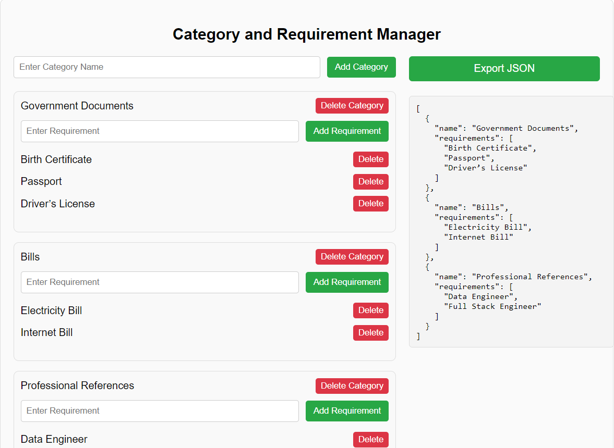
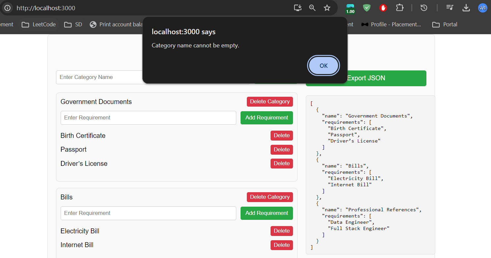
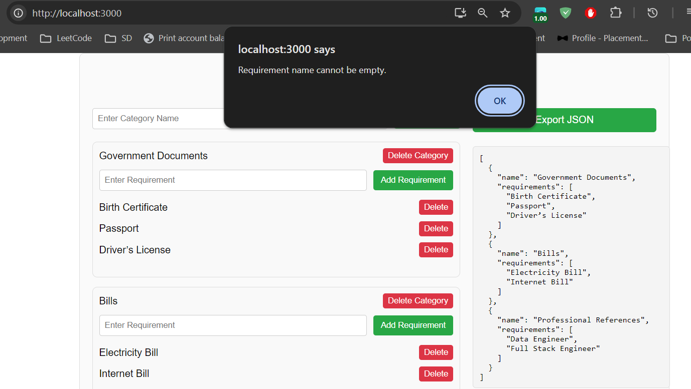
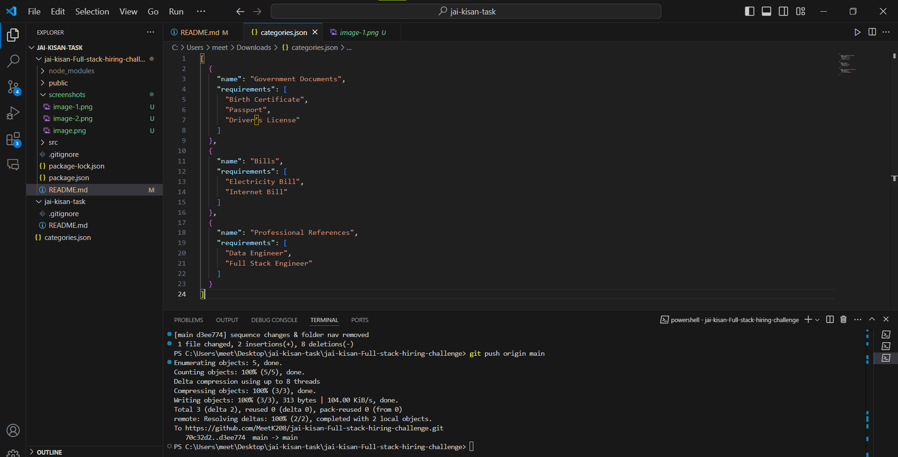

# Requirement Submission List

This is a simple React application that allows users to create categories and add requirements under each category. Users can add as many categories and requirements as needed, with options to edit category names and organize the list for easy viewing.

## Features

- **Add Categories**: Users can create and name multiple categories.
- **Add Requirements**: Under each category, users can add an unlimited number of requirements and name each one.
- **Render List**: Categories and their associated requirements are displayed on the right side of the screen.
- **JSON Print**: A button allows users to print a JSON representation of the categories and requirements to the console.

## Project ScreenShots









## Installation

### Prerequisites

- Node.js and npm (install from [Node.js](https://nodejs.org/)).

### Setup Instructions

1. **Clone the repository**

   ```bash
   git clone https://github.com/MeetK208/jai-kisan-Full-stack-hiring-challenge.git
   ```

2. **Install dependencies**

   ```bash
   npm install
   ```

3. **Run the application**

   ```bash
   npm start
   ```

   The application will be available at `http://localhost:3000`.

## Usage

1. Use the **"Add Category"** button to create a new category.
2. Enter a name for each category in the provided input field.
3. For each category, you can add requirements by clicking the **"Add Requirement"** button, with an option to name each requirement.
4. View the structured list of categories and requirements on the right.
5. To see a JSON representation of your data, click the **"Print JSON"** button, which will output to the console.

## Additional Information

This project is designed to test basic React skills, prioritizing code quality over styling. Functional components are used throughout.
